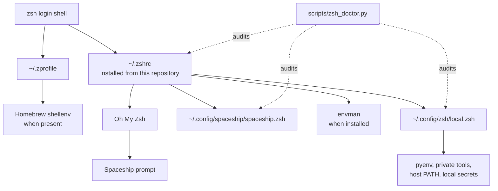

<div align="center">

# zsh_config

**A recoverable Zsh profile system for machines that move between macOS, Linux, and WSL.**

<p>
  <a href="./LICENSE"></a>
  
  
  
  
</p>

Readable first. Reversible by default. Host-specific where it belongs.

</div>

---

## What This Repository Owns

`zsh_config` is not a dotfile dump. It is a small operating contract for an interactive shell:

| Layer | Owned by | Purpose |
| --- | --- | --- |
| Shared profile | this repository | Zsh startup behavior, Oh My Zsh loading, Spaceship prompt configuration |
| Machine overlay | `~/.config/zsh/local.zsh` | private tools, host-only PATH entries, pyenv, secrets, vendor CLIs |
| Safety tooling | `setup_spaceship.sh` and `scripts/zsh_doctor.py` | preview changes, apply safely, detect drift, explain local failures |

The split is intentional: the repository should be portable, while each machine keeps its own sharp edges outside version control.

## Operating Model



## Design Commitments

- Shared shell behavior stays small, explicit, and reviewable.
- Host-specific configuration never goes into the shared `.zshrc`.
- Setup has a dry-run path before it mutates the machine.
- Runtime problems should be diagnosable with one doctor command.
- Broken completion caches, duplicate PATH entries, and template drift are treated as first-class failure modes.

## Command Surface

Most work happens through four commands:

| Intent | Command |
| --- | --- |
| Audit the current machine | `python3 scripts/zsh_doctor.py` |
| Preview setup changes | `./setup_spaceship.sh --dry-run` |
| Apply the repository profile | `./setup_spaceship.sh --apply` |
| Prove login-shell startup | `zsh -lic 'echo LOGIN_OK'` |

The setup script installs the repository `.zshrc`, copies the Spaceship configuration, creates the local override file when needed, and backs up an existing non-symlink `~/.zshrc` before replacement.

## Local State Boundary

Keep the shared profile clean. Put machine-only configuration here:

```sh
~/.config/zsh/local.zsh
```

Example local overlay:

```sh
export PYENV_ROOT="$HOME/.pyenv"
[[ -d $PYENV_ROOT/bin ]] && export PATH="$PYENV_ROOT/bin:$PATH"
command -v pyenv >/dev/null 2>&1 && eval "$(pyenv init -)"

export PATH="$HOME/.antigravity/antigravity/bin:$PATH"
```

Anything private, host-specific, experimental, or vendor-installed belongs in the local overlay.

## Doctor Checks

```sh
python3 scripts/zsh_doctor.py
```

The doctor validates the shell as a system, not just as a file:

| Check | Why it matters |
| --- | --- |
| Zsh and Oh My Zsh presence | confirms the expected runtime exists |
| Shell-file syntax | catches broken startup files before login |
| Login-shell startup | reproduces the real terminal entry path |
| Broken completion symlinks | catches stale Homebrew completions such as removed app integrations |
| Duplicate PATH entries | keeps startup predictable and less noisy |
| `~/.zshrc` template drift | detects local edits that should move into `local.zsh` |
| Local override presence | confirms the host-specific boundary exists |

For automation or structured reporting:

```sh
python3 scripts/zsh_doctor.py --json
```

## Repository Map

```text
.
|-- .zshrc                       # shared Zsh profile installed to ~/.zshrc
|-- setup_spaceship.sh           # dry-run/apply setup entrypoint
|-- spaceship/
|   `-- spaceship.zsh            # prompt layout and section configuration
|-- scripts/
|   `-- zsh_doctor.py            # machine and startup diagnostics
`-- progress/
    `-- *.md                     # session closeouts and implementation notes
```

## Recovery Notes

If `compinit` reports a missing completion file, inspect stale symlinks:

```sh
find /opt/homebrew/share/zsh/site-functions -maxdepth 1 -type l ! -exec test -e {} \; -print
```

Then rebuild the completion cache:

```sh
rm -f ~/.zcompdump*
zsh -fc 'autoload -Uz compinit && compinit'
```

If `~/.zshrc` differs from the repository template, move host-only additions into `~/.config/zsh/local.zsh`, then re-apply:

```sh
./setup_spaceship.sh --apply
python3 scripts/zsh_doctor.py
```

## Verification Matrix

Use this before pushing profile or setup changes:

```sh
zsh -n .zshrc
zsh -n setup_spaceship.sh
zsh -n spaceship/spaceship.zsh
python3 -m py_compile scripts/zsh_doctor.py
python3 scripts/zsh_doctor.py
zsh -lic 'echo LOGIN_OK'
```

Optional startup timing sample:

```sh
for i in 1 2 3; do /usr/bin/time -p zsh -lic 'exit'; done
```

## License

MIT. See [LICENSE](LICENSE).
