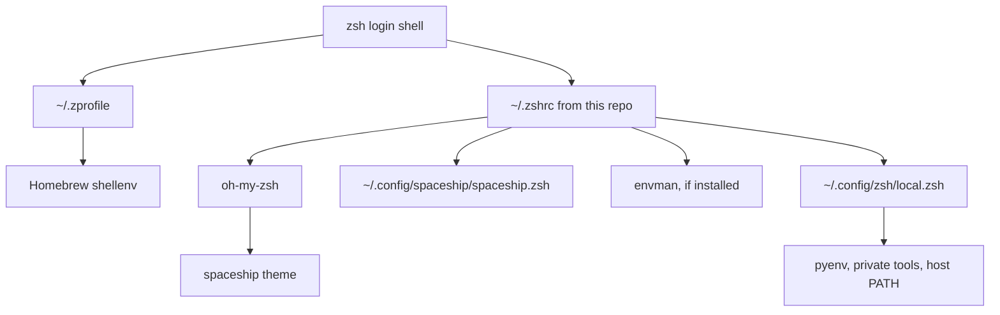

# zsh_config

Opinionated Zsh configuration for macOS and Unix-like shells built on Oh My Zsh and Spaceship.

The repository owns shared shell behavior. Machine-specific tools, secrets, and PATH changes belong in `~/.config/zsh/local.zsh`.

> Readable first. Recoverable by design. Fast enough to trust.

## Design Principles

- Shared behavior lives in the repository.
- Host-specific behavior lives in the local override.
- Every installation path has a dry-run mode.
- Every failure path has a doctor command.

## System Shape



## Install

At a glance:

| Task | Command |
| --- | --- |
| Inspect | `python3 scripts/zsh_doctor.py` |
| Dry-run install | `./setup_spaceship.sh --dry-run` |
| Apply install | `./setup_spaceship.sh --apply` |
| Validate shell | `zsh -lic 'echo LOGIN_OK'` |

Dry-run first:

```sh
./setup_spaceship.sh --dry-run
```

Apply:

```sh
./setup_spaceship.sh --apply
```

What the setup does:

- checks for Zsh and Oh My Zsh
- installs the Spaceship theme under Oh My Zsh custom themes if missing
- copies `spaceship/spaceship.zsh` to `~/.config/spaceship/spaceship.zsh`
- backs up an existing non-symlink `~/.zshrc`
- installs the repository `.zshrc`
- creates `~/.config/zsh/local.zsh` if missing

## Local Override

Use this file for host-specific state:

```sh
~/.config/zsh/local.zsh
```

Example:

```sh
export PYENV_ROOT="$HOME/.pyenv"
[[ -d $PYENV_ROOT/bin ]] && export PATH="$PYENV_ROOT/bin:$PATH"
command -v pyenv >/dev/null 2>&1 && eval "$(pyenv init -)"

export PATH="$HOME/.antigravity/antigravity/bin:$PATH"
```

Keep private or host-only logic out of the shared `.zshrc`.

## Doctor

Run:

```sh
python3 scripts/zsh_doctor.py
```

It checks:

- Zsh and Oh My Zsh presence
- syntax for repository shell files
- login shell startup errors
- broken Homebrew zsh completion symlinks
- duplicate PATH entries
- repository/template drift in `~/.zshrc`
- presence of the local override file

JSON mode:

```sh
python3 scripts/zsh_doctor.py --json
```

## Validation

```sh
zsh -n .zshrc
zsh -n setup_spaceship.sh
zsh -n spaceship/spaceship.zsh
python3 -m py_compile scripts/zsh_doctor.py
python3 scripts/zsh_doctor.py
zsh -lic 'echo LOGIN_OK'
```

Timing sample:

```sh
for i in 1 2 3; do /usr/bin/time -p zsh -lic 'exit'; done
```

## Troubleshooting

### `compinit` reports a missing completion file

Inspect broken symlinks:

```sh
find /opt/homebrew/share/zsh/site-functions -maxdepth 1 -type l ! -exec test -e {} \; -print
```

Repair the cache:

```sh
rm -f ~/.zcompdump*
zsh -fc 'autoload -Uz compinit && compinit'
```

### `~/.zshrc` differs from the repository

Move host-specific additions into `~/.config/zsh/local.zsh`, then run:

```sh
./setup_spaceship.sh --apply
python3 scripts/zsh_doctor.py
```

## License

MIT. See [LICENSE](LICENSE).
