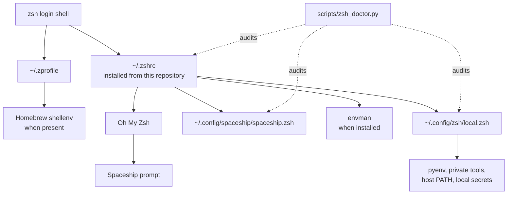

<div align="center">

# zsh_config

**Portable Zsh configuration for macOS, Linux, and WSL, with a sanitized iTerm2 profile backup for macOS.**

<p>
  <a href="./LICENSE"></a>
  
  
  
  
</p>

Shared shell and terminal settings, with machine-local configuration kept outside Git.

</div>

---

## What This Repository Owns

This repository backs up the shell configuration and the portable parts of two iTerm2 profiles:

| Layer | Owned by | Purpose |
| --- | --- | --- |
| Shared profile | this repository | Zsh startup behavior, Oh My Zsh loading, Spaceship prompt configuration |
| iTerm2 profiles | `iterm2/profiles.json` | colors, fonts, terminal behavior, and reviewed keyboard shortcuts |
| Machine overlay | `~/.config/zsh/local.zsh` | private tools, host-only PATH entries, pyenv, secrets, vendor CLIs |
| Safety tooling | `setup_spaceship.sh` and `scripts/` | preview changes, back up replaced files, diagnose startup, validate portable terminal profiles |

Shell paths use the current user's `$HOME`. The prompt displays the current user and host at runtime; it does not assign an account name or rename a user. iTerm2 profiles use neutral display names and the importing user's home directory and login shell.

## Quick Start

Run commands from your clone of this repository; its location and your account name do not matter.
Install Zsh, Git, and [Oh My Zsh](https://ohmyz.sh/) first. Python 3.10 or newer is required for the diagnostic, profile, and test tools. The prompt uses Nerd Font icons, so select an appropriate installed font in your terminal.

```sh
./setup_spaceship.sh --dry-run
./setup_spaceship.sh --apply
zsh -lic 'echo LOGIN_OK'
```

Setup installs the shell files and downloads Spaceship if it is missing. It does not change the account's default shell or import iTerm2 settings. Existing files that differ, including `.zshrc`, Spaceship configuration, and a conflicting theme link, are backed up in a unique `~/.zsh_config_backup/<timestamp>.<suffix>/` directory. Symlinks are backed up and replaced without writing to their targets. Identical files and existing `local.zsh` files are preserved.

Nonstandard Oh My Zsh and Zsh startup locations are supported through `ZSH`, `ZSH_CUSTOM`, and `ZDOTDIR`. Define them in your local environment before setup and before shell startup (for example, in the appropriate `.zshenv`); `local.zsh` loads after Oh My Zsh, too late to select its installation path.

## iTerm2 Backup and Restore (macOS)

[`iterm2/profiles.json`](iterm2/profiles.json) is a standard iTerm2 JSON profile export that can be imported directly. It contains two profiles in the original export order:

| Profile | Main font | Non-ASCII font |
| --- | --- | --- |
| Zsh Config | Monaco 18 | MononokiNF-Regular 18, enabled |
| Zsh Config 2 | Monaco 14 | Separate font disabled |

The source colors, sizes, cursor, spacing, scrollback, terminal behavior, and all 40 control-key bindings in each profile are retained. The backup uses neutral names and new, stable project GUIDs. Personal directory values are cleared, and `Custom Directory: "No"` selects iTerm2's Home Directory mode. Custom commands and startup text are empty; iTerm2 starts the importing user's login shell. This setting is defined by [iTerm2's profile preferences](https://iterm2.com/documentation-preferences-profiles-general.html).

To restore:

1. Open **iTerm2 → Settings → Profiles**.
2. In **Other Actions…** beneath the profile list, choose **Import JSON Profiles…** and select `iterm2/profiles.json` from this clone.
3. Select **Zsh Config** or **Zsh Config 2**, then open a new session. Make it the default only if you want to.
4. Under **Text**, reselect an installed Nerd Font if the exported Mononoki font names are unavailable or icons appear as boxes. The JSON does not install fonts.

Alternatively, iTerm2 supports [Dynamic Profiles](https://iterm2.com/documentation-dynamic-profiles.html). Copy the JSON to `~/Library/Application Support/iTerm2/DynamicProfiles/` to have iTerm2 monitor it. Use either manual import or dynamic loading for this backup: a dynamic profile with the same GUID as an existing regular profile is ignored. Edit dynamic settings in the copied file; keep any machine-specific changes outside the repository.

### Refresh the backup without committing a raw export

Save an iTerm2 export outside the repository, for example in Downloads, using **Other Actions… → Save All Profiles as JSON**. The sanitizer accepts the `{"Profiles": [...]}` export structure and creates names/GUIDs by profile order, so keep the order stable when updating an existing backup.

```sh
python3 scripts/iterm2_profiles.py sanitize \
  "$HOME/Downloads/iterm2-export.json" iterm2/profiles.json --force
python3 scripts/iterm2_profiles.py check
git diff -- iterm2/profiles.json
```

The sanitizer uses an explicit allowlist of visual and terminal preferences. It resets names, GUIDs, descriptions, working directories, commands, startup text, badges, tags, host bindings, triggers, and screen selection. Keyboard mappings retain only reviewed terminal control sequences; text macros, commands, profile references, and all unknown fields are omitted, including unknown nested metadata. Unsupported visual value types fail before output is written. The source file is never modified, and replacing an existing output requires `--force`.

Font labels are free text, so only the reviewed Monaco and legacy Mononoki families are accepted. Review and extend `FONT_FAMILIES` in the script when adopting another font. This is a portable backup of this setup, not a lossless archive of arbitrary iTerm2 settings. Keep a private original separately if you need SSH profiles, macros, or other local behavior. Review the diff after every export; the checker validates this allowlist, not arbitrary files or all possible secrets in the repository.

Raw exports, local overlays, tokens, hostnames, and account-specific paths belong outside Git. `.gitignore` excludes `local/`, `*.local.*`, the original export filename `iterm2_profile.json`, `.DS_Store`, and Python caches. Ignore rules do not protect a differently named export or a file already tracked by Git.

## Operating Model


```mermaid
flowchart TB
    Shell["zsh login shell"] --> Profile["~/.zprofile"]
    Profile --> Brew["Homebrew shellenv<br/>when present"]
    Shell --> Shared["~/.zshrc<br/>installed from this repository"]
    Shared --> OMZ["Oh My Zsh"]
    Shared --> ThemeConfig["~/.config/spaceship/spaceship.zsh"]
    Shared --> Envman["envman<br/>when installed"]
    Shared --> Local["~/.config/zsh/local.zsh"]
    OMZ --> Theme["Spaceship prompt"]
    Local --> HostTools["pyenv, private tools,<br/>host PATH, local secrets"]
    Doctor["scripts/zsh_doctor.py"] -. audits .-> Shared
    Doctor -. audits .-> Local
    Doctor -. audits .-> ThemeConfig
```

## Design Commitments

- Shared shell behavior stays small, explicit, and reviewable.
- Host-specific configuration never goes into the shared `.zshrc`.
- Setup has a dry-run path before it mutates the machine.
- Runtime problems should be diagnosable with one doctor command.
- Broken completion caches, duplicate PATH entries, and template drift are treated as first-class failure modes.

## Command Surface

Routine commands:

| Intent | Command |
| --- | --- |
| Audit the current machine | `python3 scripts/zsh_doctor.py` |
| Preview setup changes | `./setup_spaceship.sh --dry-run` |
| Apply the repository profile | `./setup_spaceship.sh --apply` |
| Prove login-shell startup | `zsh -lic 'echo LOGIN_OK'` |
| Validate the shared iTerm2 backup | `python3 scripts/iterm2_profiles.py check` |

The setup script installs `.zshrc` under `${ZDOTDIR:-$HOME}`, copies the Spaceship configuration, and creates a private `~/.config/zsh/local.zsh` with mode `0600` when needed. Local overlays and backups may contain private data; do not commit them or publish unreviewed doctor output, which includes local paths and shell diagnostics.

## Local State Boundary

Keep the shared profile clean. Put machine-only configuration here:

```sh
~/.config/zsh/local.zsh
```

Example local overlay:

```sh
export PYENV_ROOT="$HOME/.pyenv"
[[ -d $PYENV_ROOT/bin ]] && export PATH="$PYENV_ROOT/bin:$PATH"
command -v pyenv >/dev/null 2>&1 && eval "$(pyenv init -)"

[[ -d "$HOME/.local/bin" ]] && export PATH="$HOME/.local/bin:$PATH"
```

Anything private, host-specific, experimental, or vendor-installed belongs in the local overlay.

## Doctor Checks

```sh
python3 scripts/zsh_doctor.py
```

The doctor validates the shell as a system, not just as a file:

| Check | Why it matters |
| --- | --- |
| Zsh and Oh My Zsh presence | confirms the expected runtime exists |
| Shell-file syntax | catches broken startup files before login |
| Login-shell startup | reproduces the real terminal entry path |
| Broken completion symlinks | catches stale Homebrew completions such as removed app integrations |
| Duplicate PATH entries | keeps startup predictable and less noisy |
| `~/.zshrc` template drift | detects local edits that should move into `local.zsh` |
| Local override presence | confirms the host-specific boundary exists |

For automation or structured reporting:

```sh
python3 scripts/zsh_doctor.py --json
```

## Repository Map

```text
.
|-- .zshrc                       # shared Zsh profile installed to ~/.zshrc
|-- setup_spaceship.sh           # dry-run/apply setup entrypoint
|-- iterm2/
|   `-- profiles.json            # sanitized, directly importable iTerm2 backup
|-- spaceship/
|   `-- spaceship.zsh            # prompt layout and section configuration
|-- scripts/
|   |-- iterm2_profiles.py       # allowlist-based export and validation
|   `-- zsh_doctor.py            # machine and startup diagnostics
|-- tests/
|   `-- test_portability.py      # privacy and isolated installation regressions
`-- progress/
    `-- *.md                     # session closeouts and implementation notes
```

## Recovery Notes

If `compinit` reports a missing completion file on a Homebrew installation, inspect stale symlinks using that installation's prefix:

```sh
find "$(brew --prefix)/share/zsh/site-functions" -maxdepth 1 -type l ! -exec test -e {} \; -print
```

Then rebuild the completion cache:

```sh
rm -f ~/.zcompdump*
zsh -fc 'autoload -Uz compinit && compinit'
```

If `~/.zshrc` differs from the repository template, move host-only additions into `~/.config/zsh/local.zsh`, then re-apply:

```sh
./setup_spaceship.sh --apply
python3 scripts/zsh_doctor.py
```

## Verification Matrix

Use this before pushing profile or setup changes:

```sh
zsh -n .zshrc
bash -n setup_spaceship.sh
zsh -n spaceship/spaceship.zsh
python3 -m compileall -q scripts tests
python3 scripts/iterm2_profiles.py check
python3 -m unittest discover -s tests -v
```

Tests use temporary home directories and fixture themes without downloading dependencies or changing your installed configuration. To check the actual machine after installation:

```sh
python3 scripts/zsh_doctor.py
zsh -lic 'echo LOGIN_OK'
```

Optional startup timing sample:

```sh
for i in 1 2 3; do /usr/bin/time -p zsh -lic 'exit'; done
```

## License

MIT. See [LICENSE](LICENSE).
